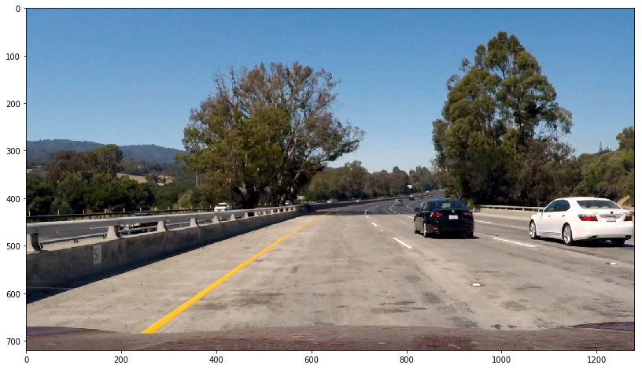
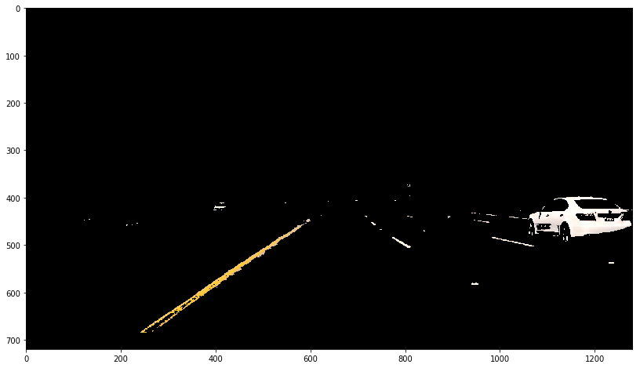

#**Finding Lane Lines on the Road** 

[//]: # (Image References)

[image1]: ./examples/grayscale.jpg "Grayscale"

---
## Overview:

The goal of this project is to make a pipeline that finds lane lines on the road using Python and OpenCV. See an example:

    

The pipeline will be tested on some images and videos provided by Udacity. The following assumptions are made:
* The camera always has the same position with respect to the road
* There is always a visible white or yellow line on the road
* We don't have any vehicle in front of us 
* We consider highway scenario with good weather conditions.

---

## Reflection

###1. Describe your pipeline.

I will use the following picture to show you all the steps:  

#### Color selection   
Firstly, I applied a color filtering to suppress non-yellow and non-white colors. The pixels that were above the thresholds have been retained, and pixels below the threshold have been blacked out.  This is the result:

I will keep aside this mask and use it later.

#### Convert the color image in grayscale  
The original image is converted in grayscale. In this way we have only one channel:

#### Use Canny for edge detection 
Before running [Canny](http://docs.opencv.org/2.4/doc/tutorials/imgproc/imgtrans/canny_detector/canny_detector.html), I applied a [Gaussian smoothing](http://docs.opencv.org/2.4/modules/imgproc/doc/filtering.html?highlight=gaussianblur#gaussianblur) which is essentially a way of suppressing noise and spurious gradients by averaging. The Canny allows detecting the edges in the images. To improve the result, I also used the OpenCV function `dilate` and `erode`.

#### Merge Canny and Color Selection
In some cases, the Canny edge detector fails to find the lines. For example, when there is not enough contrast between the asphalt and the line, as in the challenge video. The color selection, on the other hand, doesn't have this problem. For this reason, I decided to merge the result of Canny and color detection:   

#### Region Of Interest Mask
I defined a left and right trapezoidal Region Of Interest (ROI) based on the image size. Since that the front facing camera is mounted in a fix position, we supposed here that the lane lines will always appear in the same general region of the image. 
 

#### Run Hough transform to detect lines  
The Hough transform is used to detect lines in the images. At this step, I applied a slope filter, so that I can get rid of horizontal and vertical lines. This is the result:   

#### Compute lines
Now I need to average/extrapolate the result of the Hough transform and draw the two lines onto the image. I used the function  [`fitLine`](http://docs.opencv.org/2.4/modules/imgproc/doc/structural_analysis_and_shape_descriptors.html#fitline), after having extrapolated the points from the previous result with the OpenCV function `findNonZero`. I did this two times, once for the right line and another time for the left line. As a result, I got the slope of the lines, and I could draw them onto the original picture:   

## Results:

### Pictures
Here some results on test images provided by Udacity:   
     
    
             

### Videos
Here some results on test videos provided by Udacity:   

 

You can find the video files here: [video1](./yellow.mp4), [video2](./white.mp4).

#### Optional challenge:

While I got a satisfactory result on the first two video provided by Udacity, it was not the case for the challenge video. In the challenge video we can identify more difficulties:
* The color of the asphalt became lighter at a certain point. The Canny edge detector is not able to find the line using the grayscale image (where we lose information about the color)
* The car is driving on a curving road.
* There are some shadows due to some trees  

To overcome this problems I introduced the color mask and resized the ROI. This is the result, using only the color mask (without the canny detection): 

  

You can find the video files here: [video_challenge](./extra.mp4)   

In fact, if we analize the steps using a shapshot from the challenge video, we can notice that the Canny detector is not very useful:   

 

while the color mask is giving a better result:   

  
This is due to the fact that we lose valuable color information when we convert in grayscale and because the Canny operator find edges when we have shadows.   

###2. Identify potential shortcomings with your current pipeline

* This approach would not work properly:
    * if the camera is placed at a different position
    * if other vehicles in front are occluding the view
    * if one or more lines are missing
    * at different weather and light condition (fog, rain, or at night)

###3. Suggest possible improvements to your pipeline

Some possible improvements:

* Update the ROI mask dynamically
* Perform a segmentation of the road
* Using a better filter to smooth the current estimation, using the previous ones
* If a line is not detected, estimate the current slope using the previous estimations and the other line detection
* Use a moving-edges tracker for the continuos lines
